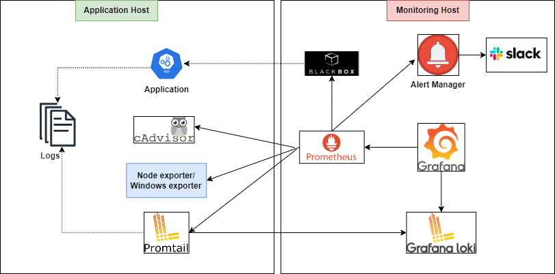
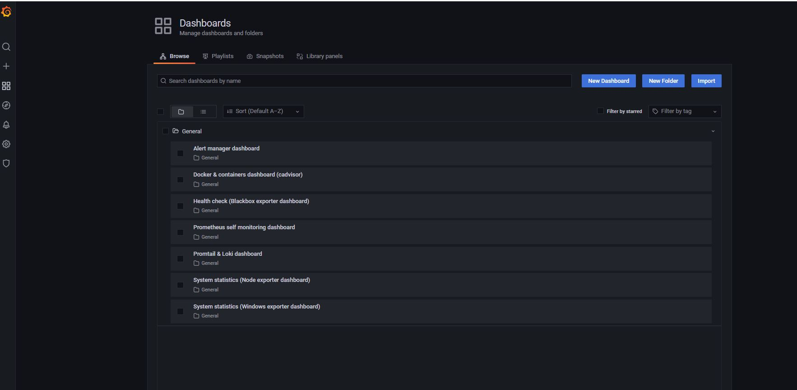
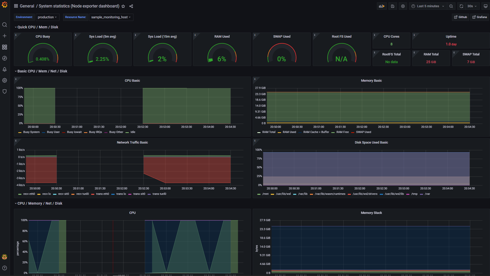
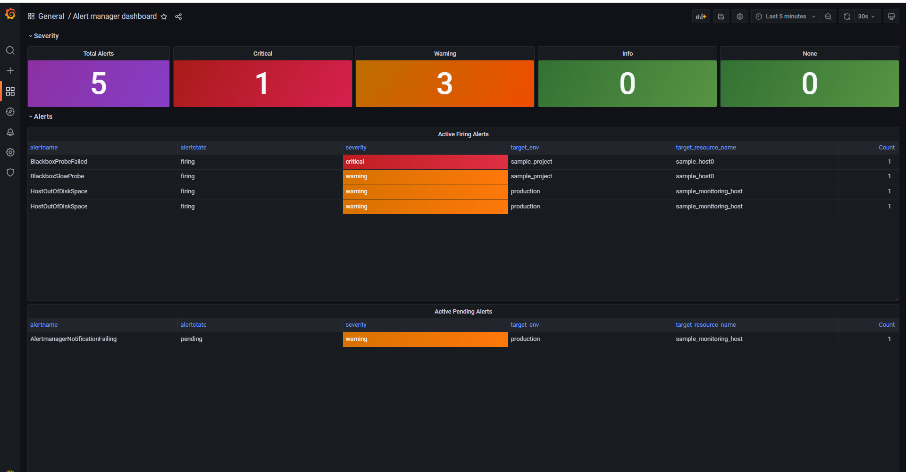
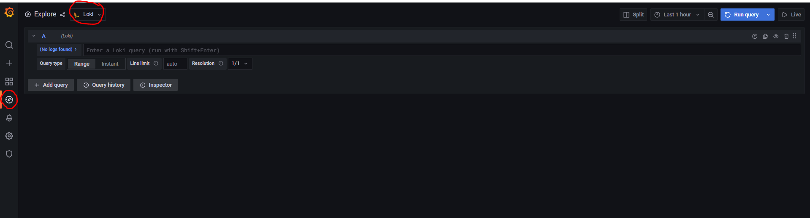

# Monitoring Architecture



In above architecture diagram, there are two parts:
- `Application Host(s)` - This virtual machine has running dockerized application along with node-explorer (to expose system metrics), promtail (to ship/expose logs metrics) and cadvisor (to expose container metrics). The application along with virtual machine host has to be monitored by monitoring host.
- `Monitoring Host`  - This virtual machine has monitoring prometheus server installed which gets metrics from application host(s) exposed by node-explorer, promtail and cadvistor etc and sends alerts to alertmanager based on prometheus rules.

Note: Monitoring tools can be installed in same application host machine, however, if you have many application host machines, it better to have a dedicated machine for monitoring all hosts.

## Overview
This tool automatically generates deployment package required for monitoring host which includes configuration related to prometheus, blackbox, node-explorer, windows-exporer, cadvisor, loki and grafana.

### Services for Application Host(s)

Please make sure below services are running on application host. (*The configuration and deployment of services related to application host is not covered in this document, however a docker-compose file can be used to install below services in application host machine*)

* Application
  * outputs log to file or console
  * exposes at port 8080 (port can be anything)
* node exporter
  * an agent that gathers os metrics(cpu/memory/disk etc)
  * 9100/metrics
* Promtail
  * an agent that ships the logs from the local system directly to the Loki cluster
  * 9080/metrics: It can also expose endpoint related to custom metrics such as log count
* cadvisor (if application is deployed in docker)
  * Developed & maintained by `Google` which collects real-time monitoring data (resource usage, performance characteristics etc) of containers
  * 8080/metrics

### Services for monitoring host

* prometheus
  * metrics server
  * 9090/metrics
* blackbox exporter
  * network monitoring agent
  * it can monitor several protcols like tcp, ping, http, and so on
  * 9115/metrics
* Alertmanager
  * send notification to somewhere like slack, mail, pagerduty and so on
  * 9093/metrics
* Loki
  * log server
  * it offers log recoding and searching
  * 3100/metrics
* Grafana
  * viewer server
  * it can send query to prometheus, loki, and so on
  * 3000/metrics
* cadvisor (used for docker containers running in monitoring host)
  * Developed & maintained by `Google` which collects real-time monitoring data (resource usage, performance characteristics etc) of containers
  * 8080/metrics
* node exporter (used for monitoring host itself)
  * an agent that gathers os metrics(cpu/memory/disk etc)
  * 9100/metrics


### Generate monitoring host deployment package automatically

To generate the package automatically, please follow below steps:

- Go to `templates/.env` file and fill it with required information related to monitoring host itself and information related to all the application hosts.
- Run the bash script `./scripts/generate_skeleton.sh`
- The package will be generated at folder `_package/monitoring`. (Please refer sample package)
- Now, you can copy `monitoring` folder to remote monitoring host machine.
- The next step is to install `monitoring/host/resource-monitoring.service` 
- OR you can run docker compose directly
```
	cd monitoring/docker
	docker-compose up -d
```
- Once all docker containers are running, please validate below urls:
```bash
	#prometheus
	curl -k http://localhost:9090/metrics
	#alertmanager
	curl -k http://localhost:9093/metrics
	#blackbox exporter
	curl -k http://localhost:9115/metrics
	#grafana
	curl -k http://localhost:3000/metrics
	#loki
	curl -k http://localhost:3100/metrics
	#cadvisor (related to monitoring host itself)
	curl -k http://localhost:8080/metrics
	#nodeexporter (related to monitoring host itself)
	curl -k http://localhost:9100/metrics
```

### View grafana dashboards

- Go to `http://<monitoring-host-ip-address>:3000` (eg: http://localhost:3000)
- Username is `admin` and password is `password`
- In left panel, go to `Dashboards` -> `Manage`
- It will show you all the available dashboards
- You can mark the dashboard as favorite

### View miyabi logs in loki

- Go to `http://<monitoring-ip-address>:3000` (eg: http://localhost:3000)
- In left panel, go to `Explore` icon
- Select `Loki` from dropdown list
- Click on `Log browser`
- Select the labels (you can filter based on label selection)
- Run query

**Grana Dashboards**



**Grana Node exporter Dashboard**



**Grana Cadvisor Dashboard**


**Grana Alertmanager Dashboard**



**Grafana Loki**
